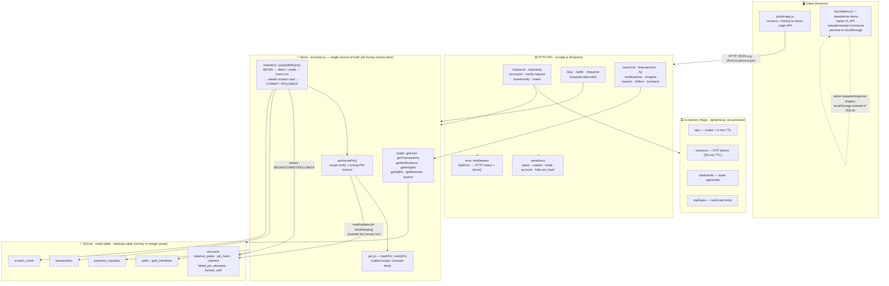

# UPI-Clone — Data-flow architecture

How data moves through the app. The **store is the single source of truth** and
the only place money changes; the API is a thin validation/serialization layer;
auth state (OTP codes, session tokens, bank approvals) lives in ephemeral memory,
while money and records live in SQLite.

## Two representative flows

**Onboarding (GPay-style claim):**
`phone → POST /otp/send` (code stored in `otps`) `→ POST /otp/verify` (issues a
token in `sessions`) `→ GET /accounts?phone` `→ POST /verify-request` (pending
entry in `bankVerifs`) `→ POST /bank/verify/:id/approve` `→ POST /claim`
(needs **both** a valid session token **and** an approved bank verification →
stores a salted scrypt PIN hash and flips `claimed=1` on the account row).

**Payment:**
`POST /pay {from,to,amount,pin}` → `app.js` validates + converts rupees→paise →
`store.transfer()` → `authorizePin()` (scrypt verify; on 3 wrong PINs the account
locks for 15 min, and that bookkeeping persists *outside* the money transaction)
→ atomic `BEGIN` → debit payer, credit payee, insert transaction, award a scratch
card → `COMMIT` (or `ROLLBACK` on any failure, e.g. insufficient balance) →
serialized response (paise→rupees, PIN hash never included).
